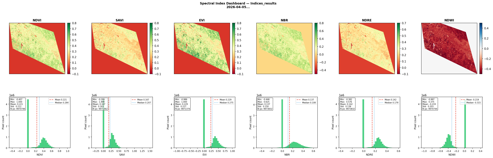

<div align="center">

# sentinel2-spectraldex

**Automated Sentinel-2 spectral index pipeline — no subscription required**

[](LICENSE)
[](https://www.python.org/)
[](https://dataspace.copernicus.eu/)
[](https://sentinels.copernicus.eu/web/sentinel/missions/sentinel-2)

</div>

---

Give the pipeline a polygon and a date range. It searches the [Copernicus Data Space Ecosystem](https://dataspace.copernicus.eu/), downloads only the 7 bands it needs (no full ~1 GB SAFE archives), merges multi-tile AOIs automatically, and delivers six analysis-ready spectral index GeoTIFFs plus a validation dashboard — all from a free CDSE account.

```
your_aoi.gpkg  +  date range  →  NDVI · SAVI · EVI · NBR · NDRE · NDWI  (float32 GeoTIFF)
```

---

## Example output



*Six spectral indices computed from a Sentinel-2 L2A scene over a ~360,000 ha study area in southern Spain (April 2026, cloud cover < 1 %). Each panel shows the spatial distribution and pixel-level histogram. The low NDWI (mean −0.22) confirms predominantly dry vegetation, while NDRE (mean 0.14) captures chlorophyll variation beneath dense canopy where NDVI saturates.*

---

## Pipeline

```
Step 0  ──  OAuth2 authentication (CDSE)
Step 1  ──  Load AOI from .gpkg → reproject → interactive map preview
Step 2  ──  Search L2A scenes (date, cloud cover, AOI) → deduplicate
Step 3  ──  Download B02 B03 B04 B05 B8A B11 B12 via HTTP streaming
Step 4  ──  Merge tiles → clip to AOI → compute 6 indices → LZW GeoTIFF
Step 5  ──  Validation dashboard: spatial maps + histograms + statistics
```

---

## Key features

| Feature | Detail |
|---------|--------|
| **Free API** | Uses CDSE OData HTTP + OAuth2 — no Sentinel Hub subscription |
| **Band-selective** | Downloads only 7 bands per scene instead of the full SAFE archive |
| **Multi-tile** | Automatically detects and merges MGRS tiles when the AOI crosses boundaries |
| **6 indices** | NDVI, SAVI (configurable L), EVI, NBR, NDRE, NDWI |
| **Analysis-ready output** | float32 · LZW compressed · tiled 256×256 · nodata masked |
| **Rate-limit safe** | Retries on HTTP 429 with exponential backoff |

---

## Getting started

### 1. Install dependencies

```bash
pip install -r requirements.txt
```

### 2. Set credentials

Register for free at [dataspace.copernicus.eu](https://dataspace.copernicus.eu/), then:

```bash
# Linux / macOS
export CDSE_USER="your_email@example.com"
export CDSE_PASSWORD="your_password"

# Windows (PowerShell)
$env:CDSE_USER = "your_email@example.com"
$env:CDSE_PASSWORD = "your_password"
```

> Alternatively, copy `.env.example` to `.env` and fill in your credentials. The `.env` file is git-ignored and will never be committed.

### 3. Configure and run

Open `sentinel2_pipeline.ipynb` and search for `# Change it` — those are the only lines you need to edit:

| Step | Parameter | What to set |
|------|-----------|-------------|
| 0 | `CDSE_USER / CDSE_PASSWORD` | Your CDSE credentials (or use env vars) |
| 1 | `GPKG_PATH` | Path to your AOI `.gpkg` file |
| 2 | `date_start / date_end` | Temporal window for scene search |
| 2 | `max_cloud_cover` | Maximum cloud cover threshold (%) |
| 3 | `output_dir` | Folder for downloaded raw bands |
| 4 | `output_root` | Folder for computed index GeoTIFFs |
| 4 | `savi_L` | SAVI soil adjustment factor (see table below) |

Run all cells in order — each step feeds into the next.

---

## Spectral indices

| Index | Formula | Application |
|-------|---------|-------------|
| **NDVI** | (B8A − B04) / (B8A + B04) | General vegetation greenness |
| **SAVI** | ((B8A − B04) / (B8A + B04 + L)) × (1 + L) | Vegetation over sparse/bare soils |
| **EVI** | 2.5 × (B8A−B04) / (B8A+6×B04−7.5×B02+1) | Dense canopy without saturation |
| **NBR** | (B8A − B12) / (B8A + B12) | Burn severity, post-fire mapping |
| **NDRE** | (B8A − B05) / (B8A + B05) | Canopy chlorophyll in dense forests |
| **NDWI** | (B03 − B8A) / (B03 + B8A) | Surface water and soil moisture |

> **Why NDRE?** In closed-canopy forests and silvopastoral systems, NDVI saturates above ~0.8. NDRE uses the red-edge band (705 nm) and remains sensitive to chlorophyll content even at high biomass levels.

### SAVI L factor

| L | Fractional canopy cover |
|---|------------------------|
| `0.0` | Dense canopy — FCC > 90 % |
| `0.25` | Moderately dense — FCC 60–90 % |
| `0.5` | Intermediate — FCC 30–60 % *(default)* |
| `0.75` | Sparse — FCC 10–30 % |
| `1.0` | Bare or very sparse — FCC < 10 % |

---

## Output structure

```
sentinel2_data/
├── raw_bands/
│   └── 2024-06-15/
│       ├── T30SUH/
│       │   ├── B02.jp2  ├── B03.jp2  ├── B04.jp2
│       │   ├── B05.jp2  ├── B8A.jp2  ├── B11.jp2  └── B12.jp2
│       └── T30SVF/
│           └── ...
└── index_results/
    └── 2024-06-15/
        ├── NDVI.tif  ├── SAVI.tif  ├── EVI.tif
        ├── NBR.tif   ├── NDRE.tif  ├── NDWI.tif
        └── dashboard_2024-06-15.png
```

Output GeoTIFFs are float32, LZW-compressed, tiled (256 × 256 blocks) and ready to open directly in QGIS, GDAL, or rasterio.

---

## Technical notes

- **Token refresh** — CDSE OAuth2 tokens expire after 10 minutes. The pipeline requests a fresh token before every HTTP call, so long batches never fail mid-download.
- **Rate limiting** — CDSE enforces download quotas. Keep `n_threads = 1` for large batches; the pipeline retries automatically on HTTP 429 with a 30-second backoff (3 attempts).
- **Multi-tile merge** — when the AOI intersects more than one MGRS tile, scenes are merged in memory before clipping and index computation. No intermediate files are written.
- **Deduplication** — if the same date/tile appears from multiple satellites (S2A, S2B, S2C) or processing runs, the pipeline keeps the lowest cloud cover version automatically.

---

## License

Distributed under the [MIT License](LICENSE).
